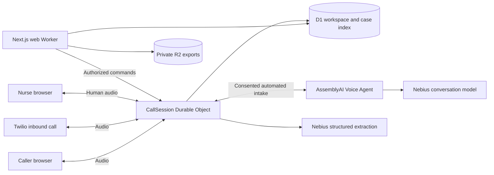

# NurseBridge

Voice intake and human handoff for nursing teams.

NurseBridge brings browser and telephone callers into one workspace. It organizes caller-reported information into a draft linked to source statements, preserves corrections and uncertainty, and lets a nurse take over the conversation with two-way audio.

## Capabilities

- **One call queue:** browser invitations and optional Twilio inbound numbers route to the same workspace, with call ownership, arrival order, and connection status.
- **Evidence-linked intake:** finalized caller statements support draft facts. Corrections retain their history; unknown, denied, uncertain, and not measured remain distinct.
- **Human handoff:** a nurse claims the call and takes over after both audio paths acknowledge playback. Callers can request a person, including with telephone DTMF `0`.
- **Bounded automation:** explicit consent, one clarification per unresolved answer, provider shutdown on handoff, call deadlines, and concurrency and usage limits.
- **Private case handling:** workspace-scoped authorization, short-lived invitations and socket tickets, private exports, deletion fences, and case-content expiry.

Phone-to-nurse routing can operate independently of automated intake. A real telephone deployment requires an owned Twilio number, credentials, HTTPS endpoints, and carrier acceptance testing; the local phone test uses a signed protocol emulator.

## Architecture



The realtime Worker owns the call state machine and audio. The web Worker handles the interface and business HTTP API. Durable Object storage is authoritative; D1 holds query projections. Human conversation audio bypasses the AI providers. See the [architecture](docs/architecture.md) for ownership, recovery, and deletion guarantees.

## Local development

Use Node **24.14.1** (`.node-version`) and pnpm **11.19.0** (`packageManager`).

For a repeatable walkthrough with fresh data and all external providers disabled:

```sh
pnpm install --frozen-lockfile
pnpm demo
```

Open the printed workspace URL, create a local workspace, then follow the guide. Use another browser profile for the caller invitation. `pnpm demo` builds the app and starts an isolated loopback runtime; it ignores local provider secrets and keeps its temporary data separate from development. Ctrl+C stops it, and the next run starts fresh. For a current build, `pnpm demo --skip-build` skips rebuilding. If ports are occupied, set `NURSEBRIDGE_QA_WEB_PORT=8899 NURSEBRIDGE_QA_REALTIME_PORT=8900`. See the [demo script](docs/demo-script.md) and [submission packet](docs/hackathon-submission.md).

For persistent local development:

```sh
pnpm install --frozen-lockfile
pnpm db:migrate
pnpm db:seed
pnpm dev
```

Open [the workspace guide](http://localhost:8787/workspace), create a local workspace, then open a caller invitation in a separate browser profile. Each participant must enable microphone and speaker access. Use headphones.

Local configuration enables workspace enrollment only on matching HTTP loopback origins. Hosted deployments reject public workspace creation and require verified Cloudflare Access identity for staff sessions. Caller invitations remain scoped to their workspace. Managed staff provisioning and session renewal are tracked release requirements.

Local development starts with providers disabled and supports transcript replay for repeatable testing. It requires no AI or carrier credentials. Microphone capture, framing, relay, playback, and handoff use the application audio path. Speech recognition and provider behavior require separate integration checks.

`pnpm dev` builds the Next.js/OpenNext artifact and starts both Workers through one local runtime: web on `8787`, realtime on `8788`. D1 and R2 persist under `.local/state`. Do not run separate Wrangler processes against that same state directory. `pnpm dev:next` is available for faster UI iteration on port `3000`; use the Workers runtime for integration verification.

Only copy `.dev.vars.example` to `.dev.vars` when configuring local integrations. Keep secrets out of source, logs, screenshots, and browser code. See [Voice Agent setup](docs/voice-agent.md) and [phone setup](docs/phone-inbound.md).

For local voice calling, set `PROVIDER_MODE=live` in both `apps/web/.dev.vars` and `apps/realtime/.dev.vars`. Configure the realtime file with your AssemblyAI and Nebius keys plus a versioned stored agent as described in the setup guide. For the local acceptance environment, also set `FICTIONAL_LIVE_TEST=true` in that realtime file and keep every `ALLOWED_ORIGINS` entry on an exact HTTP loopback origin. Restart `pnpm dev`, confirm `/health` reports `mode: live` and `liveActivation.ready: true`, then start a **new** caller session. Existing calls retain their original mode. The local exception does not enable hosted releases or verify recording-retention controls.

## Verification

```sh
pnpm verify                         # types, lint, unit, Workers, tooling tests, build
pnpm exec playwright install chromium
pnpm test:e2e                       # isolated runtime + full browser/phone suite
```

`test:e2e` provisions fresh temporary storage, uses test credentials, and stops its own runtime. It neither calls Twilio nor connects to AI providers. It preserves local diagnostic artifacts in a private temporary directory. Use `PLAYWRIGHT_CHANNEL=chrome` to select installed Chrome. If ports `8787/8788` are occupied, set `NURSEBRIDGE_QA_WEB_PORT=8987 NURSEBRIDGE_QA_REALTIME_PORT=8988`.

After explicitly configuring a local live runtime, `NURSEBRIDGE_LIVE_E2E=1 pnpm exec playwright test tests/browser/live.spec.ts --workers=1` verifies provider speech, transcript evidence, extraction and non-silent playback in both directions after nurse takeover. It uses the repository's audio recordings and deletes its case afterward. Leave `PLAYWRIGHT_CHANNEL` unset to use Playwright's headless shell; branded Chrome can start background update helpers that delay test shutdown on macOS.

| Command | Purpose |
| --- | --- |
| `pnpm typecheck` / `pnpm lint` | Static checks |
| `pnpm test` | Unit tests |
| `pnpm test:workers` | Durable Object and Worker integration tests |
| `pnpm test:tooling` | Deployment guard and provider setup tests |
| `pnpm test:browser` | Browser tests against an already running local test runtime |
| `pnpm test:phone` | Isolated phone protocol and nurse browser test |
| `pnpm build` | Audio worklets and deployable web Worker |
| `pnpm bindings` | Regenerate Cloudflare binding types |
| `pnpm deploy:check --env staging` | Read-only deployment configuration validation |

[CI](.github/workflows/ci.yml) runs static, unit, Workers, tooling, build, and isolated browser checks without provider secrets. Local evidence and its limits are recorded in [test results](docs/test-results.md). A green test suite does not establish live carrier, physical-device, clinical, or production acceptance.

## Deployment and operations

**Release status: pre-production.** Managed staff provisioning, provider recording controls, and hosted acceptance remain [release requirements](docs/production-readiness.md). Public automated intake stays disabled until the provider controls are verified. The software collects information and supports human handoff; it does not diagnose, recommend treatment, assess clinical urgency, or determine that waiting is safe.

Staging and production have separate configuration blocks, databases, buckets, and Worker bindings. Templates intentionally contain unresolved values. Start with the [deployment guide](docs/deployment.md); configure resources, identity policies, secrets, retention, and ownership before deploying.

```sh
pnpm deploy:check --env staging
pnpm deploy --env staging
```

Use `--env production` only for the production environment. Deployment validates configuration, builds and dry-runs both Workers before any remote migration or upload. These checks cannot certify provider account settings, resource access policies, or operational readiness. No deploy runs automatically in CI.

Application case content expires after seven days. Provider recording retention, backups, metadata cleanup, and long-lived organization accounts have separate requirements. Read the [operations runbook](docs/operations.md), [safety and privacy boundaries](docs/safety-and-privacy.md), and [release checklist](docs/production-readiness.md) before enabling an environment.

## Repository

| Path | Responsibility |
| --- | --- |
| `apps/web` | Next.js interface, HTTP API, sessions and authorization |
| `apps/realtime` | CallSession state, media, provider adapters, projections and cleanup |
| `packages/contracts` | Shared protocol and schemas |
| `packages/audio-client` | Browser audio capture, playback and framing |
| `packages/intake-policy` | Collection policy and evidence validation |
| `packages/database` | D1 schema and migrations |
| `tests` | Unit, browser and integration test fixtures |
| `scripts` | Local runtime, release checks and integration tooling |

See [contributing](CONTRIBUTING.md), [security reporting](SECURITY.md), [compatibility](docs/compatibility.md), and [production readiness](docs/production-readiness.md).
