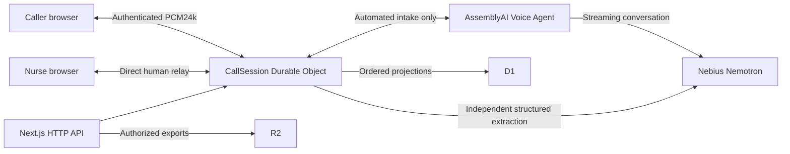

# Architecture

Two independently deployed Workers retain actual Next.js Route Handlers and a Workers-native media component. No Node server runs in production.

The Voice Agent owns conversational turn-taking and audio generation. CallSession remains authoritative for consent, collection progress, evidence, completion, escalation, ownership and retention. Model tool calls are proposals: the server waits for independent extraction through the relevant finalized turn, validates the requested action, and stores command receipts transactionally.

Snapshot version 2 adds per-field question/clarification progress, caller recording consent, assistant transcripts, waiting reason, provider lifecycle, and a call deadline. Legacy snapshots are upgraded without treating prior consent as recording consent or switching live audio providers mid-call. Recovery stops automated intake and requests a human.

The caller sends 24 kHz mono PCM16 in 1,200-sample frames. After successful collection or an unresolved answer following one clarification, the provider session ends while the browser call waits for a nurse. The overall ten-minute call deadline still applies. Explicit denials and unmeasured facts retain their meaning. No symptom-based triage exists.

## Authority and interfaces

CallSession SQLite owns state, finalized transcripts, fact revisions, command receipts, ticket nonces, and outbox events. D1 provides workspace metadata and query projections. No transaction spans the two systems. A queue is advertised only after its initialization projection succeeds.

Event revision orders recoverable changes. Control revision protects claims independently of transcript arrivals. Control epoch and response generation invalidate obsolete audio and inference. Every application mutation uses an idempotency command ID; changed-payload reuse is rejected.

HTTP commands stay in Next.js. Realtime's public entry only accepts authenticated media sockets and a content-free health check. Connection tickets are opaque random capabilities backed by server-side call/workspace/participant/role/audience/expiry/nonce records; clients cannot modify claims. The ticket is transmitted in the first socket message, never its URL.

Queue state, intake state, ownership, AI failure, review, escalation, connectivity and deletion remain separate. CLOSED means operationally ended, not a clinical disposition.

## Audio and takeover

Capture and playback use AudioWorklet. Stateful filtering/resampling converts the actual input rate into 24 kHz mono PCM16LE and 50 ms frames. Application envelopes are removed before the Voice Agent. Synthesized output and nurse microphone paths never enter the Voice Agent.

Takeover requires an exclusive claim, enabled microphones/playback, fresh readiness, epoch advancement, caller playback-worklet flush acknowledgment, and peer-frame playback acknowledgments in both directions. An open socket alone does not establish connection. Human audio bypasses providers. Missing heartbeat or failed handoff leaves a retryable human request and never silently restarts AI.

WebSocket audio is a bounded MVP transport. TCP head-of-line blocking makes packet loss stall newer audio; limited networks can cause underruns and visible gaps. This is neither WebRTC nor carrier-grade telephony. The audio transport interface can later be replaced with Cloudflare Realtime/WebRTC. A future telephony adapter must authenticate its participants, translate media, preserve epochs and consent, and satisfy separate carrier/privacy requirements; this demo answers no telephone numbers.

## Durability

State and outbox insertion use synchronous SQLite transactions without network I/O. Ordered D1 writes require the previous projection checkpoint and no deletion tombstone. Retries cannot duplicate facts or resurrect deleted cases. Alarms handle retry, claim/handoff timeout, session bounds, and retention.

Outbound Voice Agent connections are active paid work and prevent normal hibernation. Calls are bounded to ten minutes. Restart reloads durable control, invalidates output, and exposes a gap; a new authenticated connection is required. Providers do not restart automatically after a failure, reconnect, waiting transition or takeover.

Private R2 export keys are reserved before upload and checked again afterward. Deletion installs permanent content-free fences, closes providers, removes primary content and schedules cross-store cleanup. Backup retention and provider retention remain separate limitations.

## Recording lifecycle

Provider session IDs are reserved for cleanup when the upstream session is created, including configuration failure. The provider cleanup table survives content deletion; alarms retry logical session deletion without making deleted case data readable again. Provider deletion is soft deletion; physical purge/account retention remain unverified and keep live activation blocked. No recordings are copied to R2 and no provider artifact URLs are exposed.
